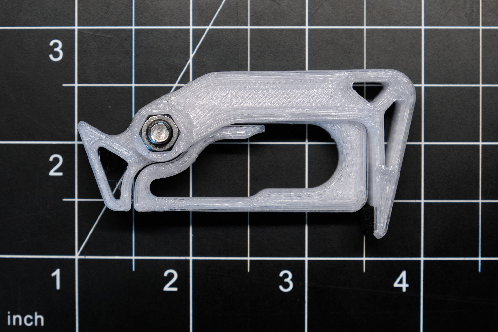
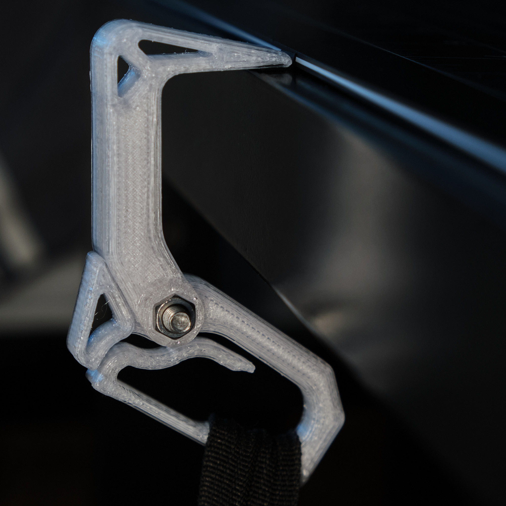
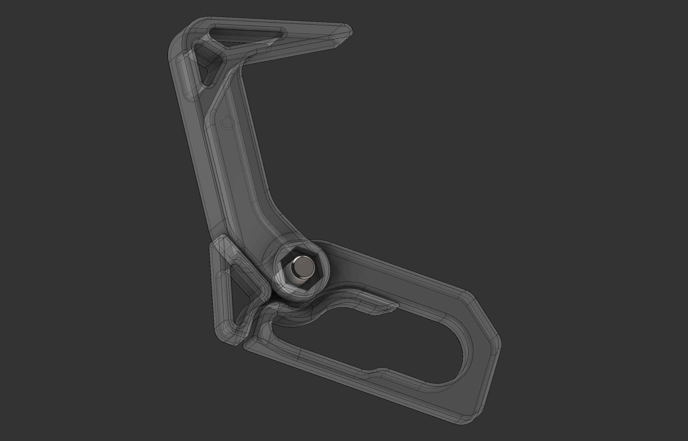

<a href="../assets/projects/hanger2-stl.zip" class="button">Download STL Files (zip)</a>
<a href="https://www.printables.com/model/145011-compact-folding-backpack-hanger-v20" class="button">View on Printables</a>

## Summary

Changes from V1.0 (2019):
* New single-piece "carabiner" design for attaching to backpack strap
* New hook design that reduces stress at the corner of the hook while keeping the same right-angle hook geometry
* Made parts slightly smaller overall and significantly reduced material usage with only a minor decrease in strength

When printed in PETG according to the instructions, I would recommend using this hanger to hold no more than 8kg (17.5lb). Based on FEA simulations and physical testing, the actual yield strength will be several times that.

This will hang from the top of a door, a hole in <20mm thick material, or a similar object without any modification, but adding some nonslip material such as thin neoprene foam tape to the tip of the hook allows it to hang off a flat surface such as the edge of a table as shown below.

## Printing
Print with 100% infill in PETG, PC, PA, or any tough and slightly flexible material. 21c-p2 hook.stl must be printed on its side with supports enabled.

## Assembly
Assemble the clip body and hanging hook as shown in the pictures and screw them together with an M5x16mm screw and an M5 nut, preferably a Nylok nut. Insert the strap of your bag through the loop in the hanger.

### License
This work is licensed under a [Creative Commons Attribution-ShareAlike 4.0 International License](http://creativecommons.org/licenses/by-sa/4.0/).
