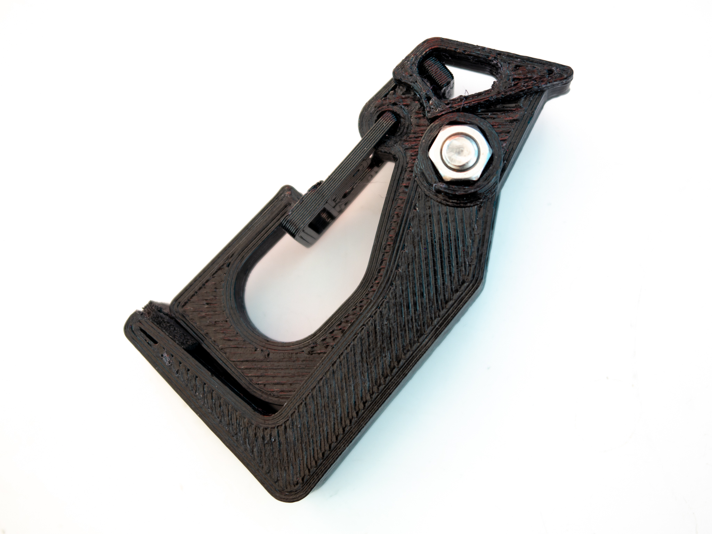
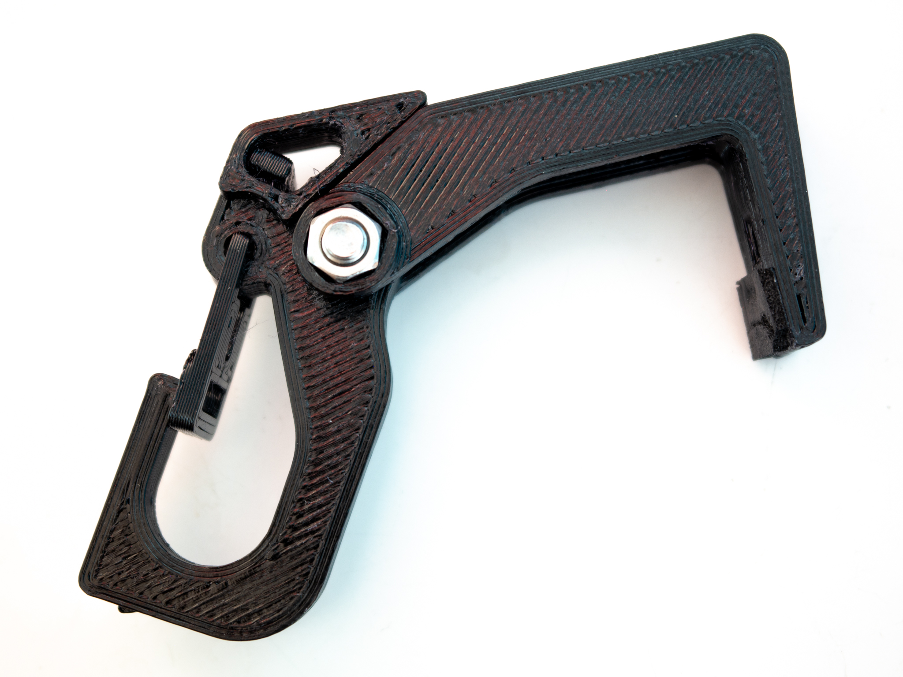

<a href="../assets/hanger/hanger STLs.zip" class="button">Download STL Files (zip)</a>
<a href="../assets/hanger/Backpack Hanger v71 Final 2019-09-18.f3d" class="button">Download Fusion 360 Archive</a>

[Originally published on Thingiverse](https://www.thingiverse.com/thing:3869162)

## Summary

The hanger should be able to hold 11.4kg (25lb) without issues, and the actual yield strength is several times that (safety factor of 3). This was first tested in FEA simulation and confirmed in physical testing. These numbers only apply to parts printed from PETG at 100% infill with good layer adhesion.

This will hang from the top of a door, a hole in <20mm thick material, or a similar object without any modification, but adding some nonslip material such as thin neoprene foam tape to the tip of the hook allows it to hang off a flat surface such as the edge of a table as shown above.

Fusion 360 original design file included.

## Printing
Print with 100% infill. Supports are required for Hanger.stl only. PETG, nylon, or stronger materials are recommended. Carabiner_Door.stl needs to bend during assembly and use, so ABS or PLA may be too brittle (untested).

### Parts and Assembly
Assemble the clip body and hanging hook as shown in the pictures and screw them together with an M5x18mm or M5x20mm screw and an M5 nut, preferably a Nylok nut. Insert the carabiner door into the clip body as shown in the pictures. The door will have to bend to snap into place, but it shouldn't break.

### License
This work is licensed under a [Creative Commons Attribution-ShareAlike 4.0 International License](http://creativecommons.org/licenses/by-sa/4.0/).
