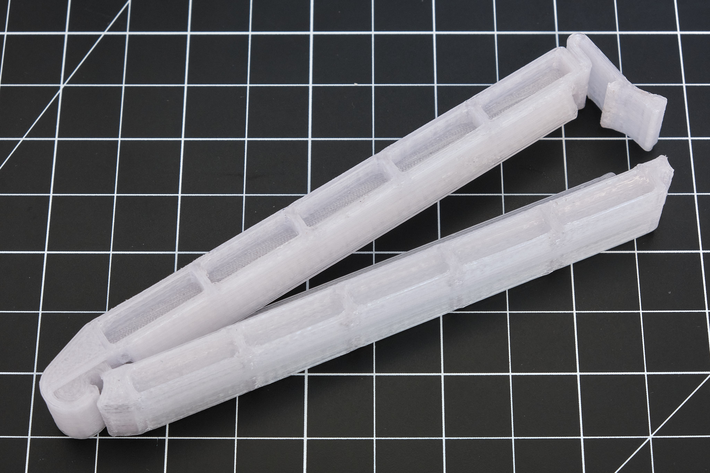
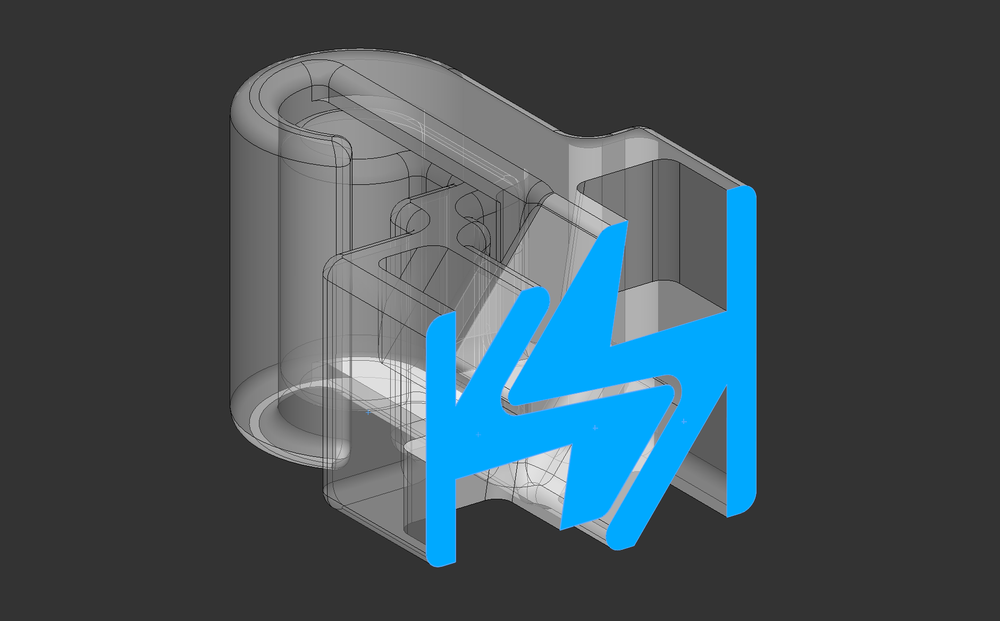
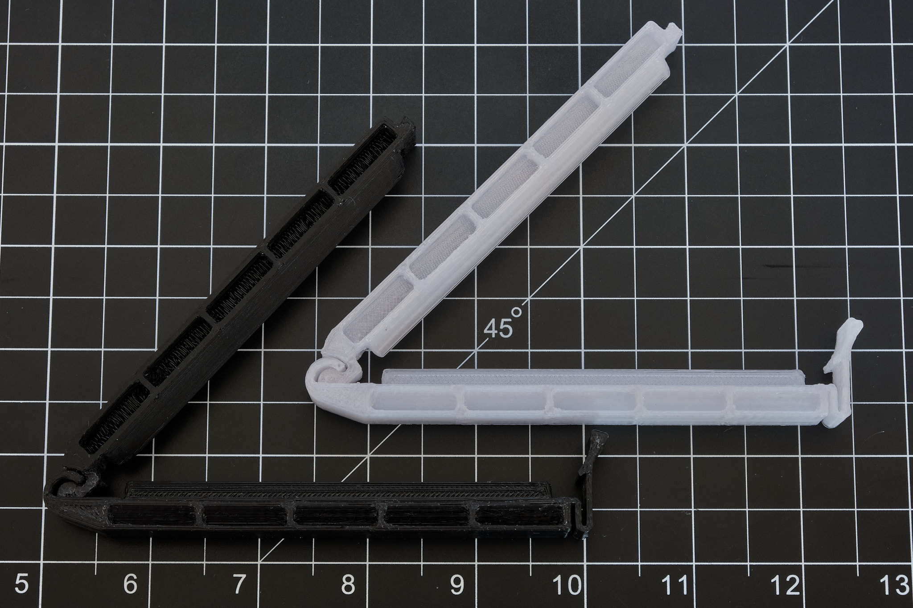

<a href="../assets/projects/bagclip-stl.zip" class="button">Download STL Files</a>
<a href="https://workbench.grabcad.com/workbench/projects/gcCB1yP234_nZX1W01_76lmqixo17mWjXtkitTH1PlFbeV#/space/gcpb1Bv80sNtC4WU5TikOFvemghJoOa-dDuEDdxJYnSFva/folder/10515119" class="button">View on GrabCAD</a>
<a href="https://www.thingiverse.com/thing:4889939" class="button">View on Thingiverse</a>

## Summary

3D printable bag clip that creates a near-airtight seal with most plastic bags, from standard 2mil polyethylene bags to thick multilayer coffee bags. This clip clamps the bag more aggressively than other designs and does not rely on flexure hinges or print-in-place parts. STL files for 100mm and 160mm clips are provided; larger sizes are possible but untested. Original Solidworks CAD files can be found in the GrabCAD folder linked above.

**Note:** For the best seal, thin single-layer bags should be folded before clipping.

## Printing
Print in a material with a low flexural modulus such as PETG, PA, PC, or PP. Supports are only required on part 21a-p0010. The clips shown in the photos are printed in PETG.

### License
This work is licensed under a [Creative Commons Attribution-ShareAlike 4.0 International License](http://creativecommons.org/licenses/by-sa/4.0/).
