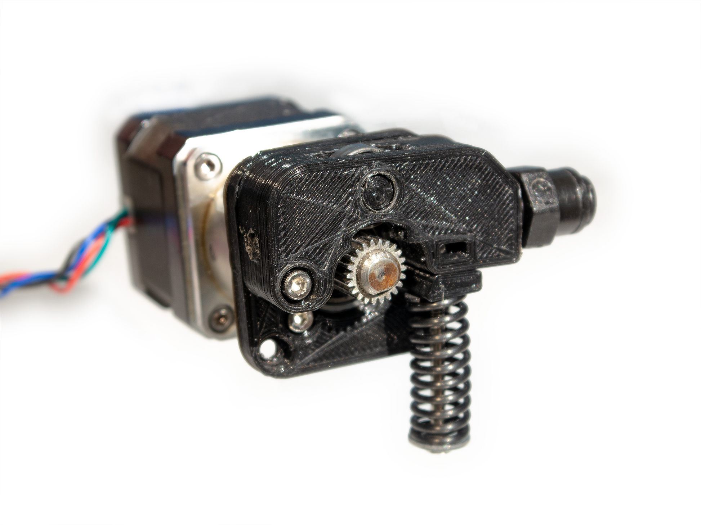
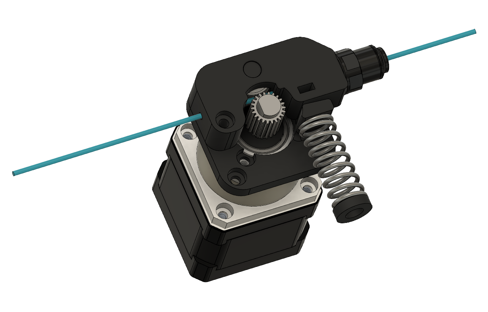
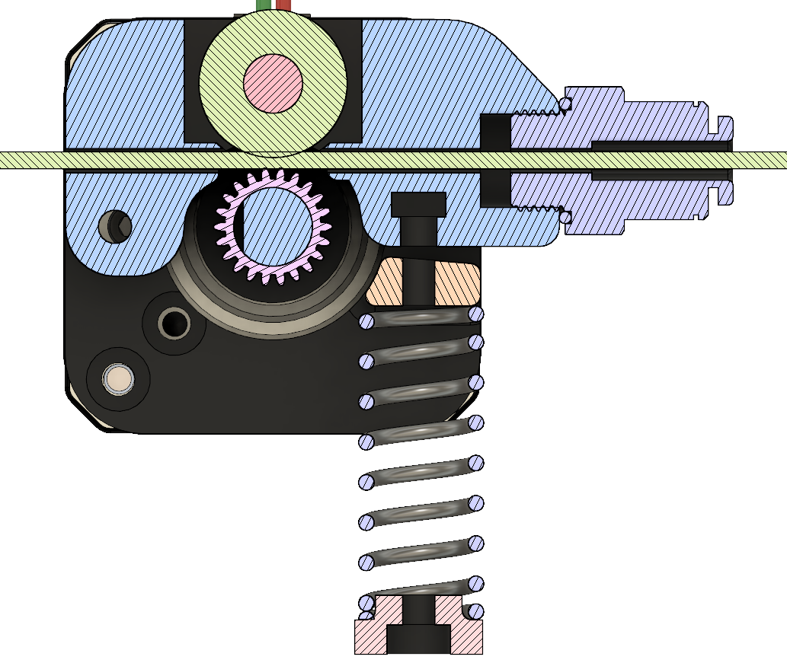

<a href="../assets/extruder/extruder STLs.zip" class="button">Download STL Files (zip)</a>
<a href="../assets/extruder/Extruder 3 v16.f3d" class="button">Download Fusion 360 Archive</a>

[Originally published on Thingiverse](https://www.thingiverse.com/thing:3457395)

## Summary

This is a small NEMA 17 sized bowden extruder using all 3D printed structural parts, designed and tested for general purpose and high-speed/high-volume printing.

To make the design simpler and smaller, the filament is routed through the pivoting arm containing the idler bearing. This also allows the extruder to accommodate different sized drive gears. A large spring puts 10kg+ (22lb+) of pressure at the point where the filament contacts the drive gear, allowing better power transfer to the filament and preventing the gear from grinding the filament.

I have used this design on my delta printer for 1 year (as of August 2019) with no noticeable wear or damage on any 3D printed parts and no failed prints caused by extruder issues.

## Component Selection Notes
### Motor
Any NEMA 17 motor will work. The mounting plate also has holes that match a [17HS15-1684S-PG5 planetary gearbox](https://www.omc-stepperonline.com/nema-17-stepper-motor-bipolar-l38mm-w-gear-raio-51-planetary-gearbox-17hs15-1684s-pg5.html), if you need one.

### Gear
Any gear with a nominal 11-12mm outer diameter that fits your NEMA 17 motor (usually 5mm shaft) or gearbox (usually 8mm shaft) will work. To take advantage of the strong grip this design can put on the filament, I would recommend a gear with long, sharp teeth such as [this one](https://www.amazon.com/BIQU-Extruder-36Teeth-Stainless-Filament/dp/B01J5ON2Y2/).

### Spring
Use a spring with specifications close to [McMaster-Carr 9657K337](https://www.mcmaster.com/9657k337):
* 31-35mm (1.25-1.375in) length
* 11-13mm (0.43-0.51in) OD
* 9-10mm (0.35-0.39in) ID
* ~0.62 kg / mm (~34.7 lbs./in.) rate

### Bearing
Use a 696 size bearing (6x15x5mm).

### Bowden Fitting
This extruder is designed for a 1/8in BSPP to 4mm tube push-to-connect fitting as [sold by E3D](https://e3d-online.com/catalog/product/view/id/8625/) or [McMaster-Carr](https://www.mcmaster.com/5449k111). Metric or imperial pipe sizes are easier to find, but E3D ships BSPP fittings with their bowden hotends.

### Hardware
All screws used are M3 socket cap.
* 3x M3x6mm / M3x8mm for mounting to motor or gearbox
* 1x M3x16mm for pivot
* 1x M3x40mm - M3x45mm for spring tensioning
* 2x M3 nuts

## Printing and Assembly Notes
I used eSUN ABS+ filament. A material stronger than PLA and 100% infill are strongly recommended.

The filament path should be cleaned out with a 2.5mm (3/32in) drill bit. Since BSPP taps are hard to find in the US, I did not tap the hole and screwed the fitting directly into the 3D printed part, which works surprisingly well.

The bearing pin is intended to fit tightly into the bearing - first put the bearing into the idler arm and then press the pin into the bearing using pliers, a vise, or an actual press. The pin is intentionally not very tight fitting into the arm.

## CAD

### License
This work is licensed under a [Creative Commons Attribution-ShareAlike 4.0 International License](http://creativecommons.org/licenses/by-sa/4.0/).
