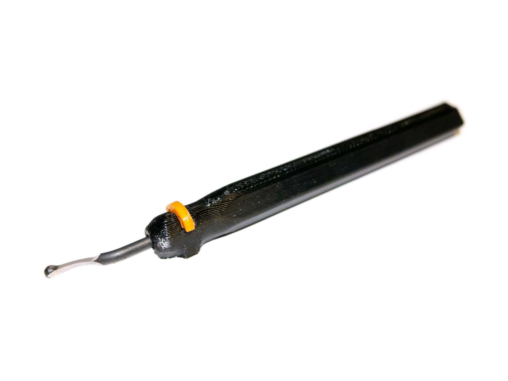
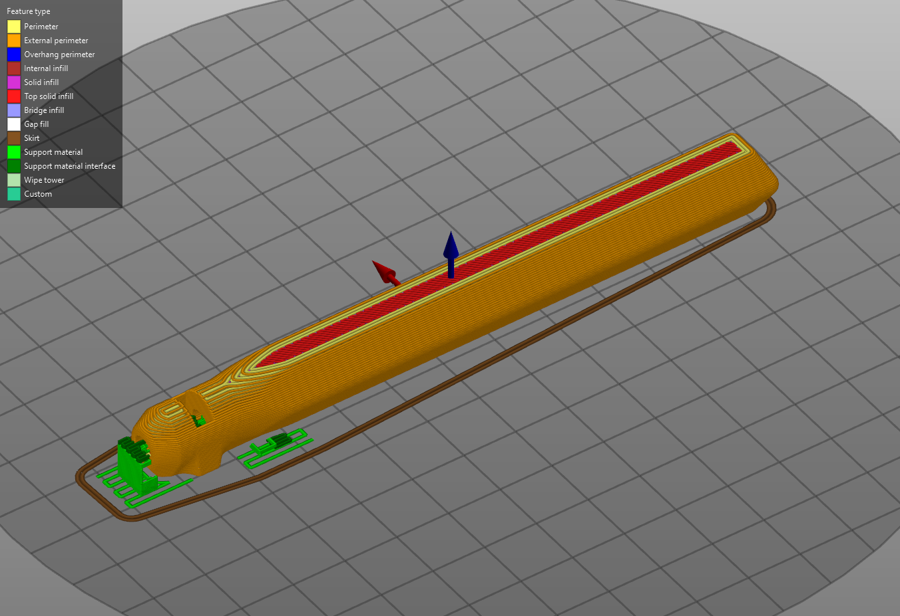
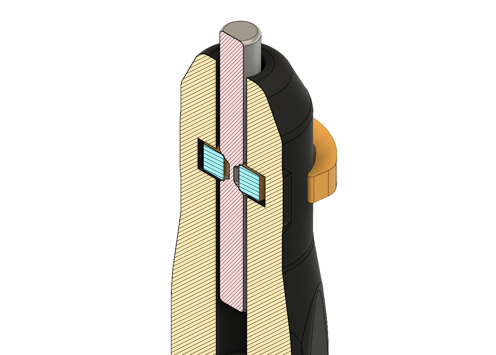

<a href="../assets/deburhandle/deburhandle STLs.zip" class="button">Download STL Files (zip)</a>
<a href="../assets/deburhandle/Deburrer v14 Final 2019-07.f3d" class="button">Download Fusion 360 Archive</a>

[Originally published on Thingiverse](https://www.thingiverse.com/thing:3776972)

## Summary

To use, insert a 0.125" shank deburring blade into the end of the handle until the groove in the blade lines up with the hole in the side of the handle. Press the clip into the hole until it snaps into place around the blade. Reverse this process to remove the blade.

Depending on your printer and the material you use for the clip, the blade will probably not spin freely but will rotate well enough for normal use (deburring holes). Friction can be reduced by enlarging the center hole on the clip or adding some grease in that area.

## Printing
Print on its flat side in any material. The proper orientation is shown below. Depending on how well your printer is tuned, you may or may not need supports to print the hole properly. If you use supports, you will probably need to drill out the hole to remove them. I used eSUN black PETG for the handle and orange PLA for the clip.

### License
This work is licensed under a [Creative Commons Attribution-ShareAlike 4.0 International License](http://creativecommons.org/licenses/by-sa/4.0/).
