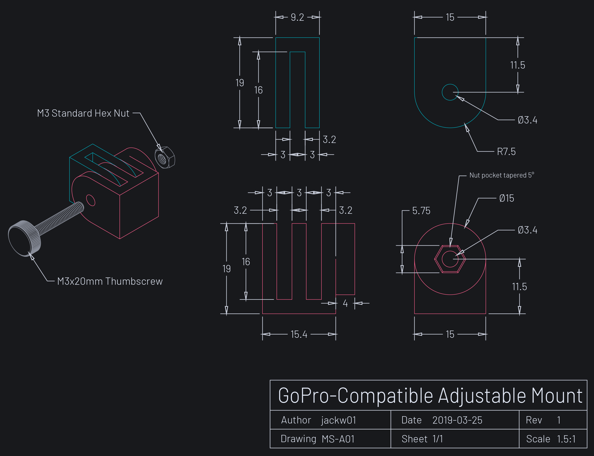

<a href="../assets/gopro/Gopro Profile Master Drawing v9-01.png" class="button">Download Image</a>
<a href="../assets/gopro/Gopro Profile Master Drawing v9.pdf" class="button">Download Printable PDF</a>
<a href="../assets/gopro/Gopro Profile Master Drawing v9.f3d" class="button">Download Fusion 360 Archive</a>

The Fusion 360 CAD model and the information contained in the drawings may be used without attribution for any purpose.

##### Disclaimer
<small>These drawings and CAD models are not affiliated with, endorsed by or in any way associated with GoPro Inc. or its products and services. GoPro, HERO, Session, Karma and their respective logos are trademarks or registered trademarks of GoPro, Inc.</small>
