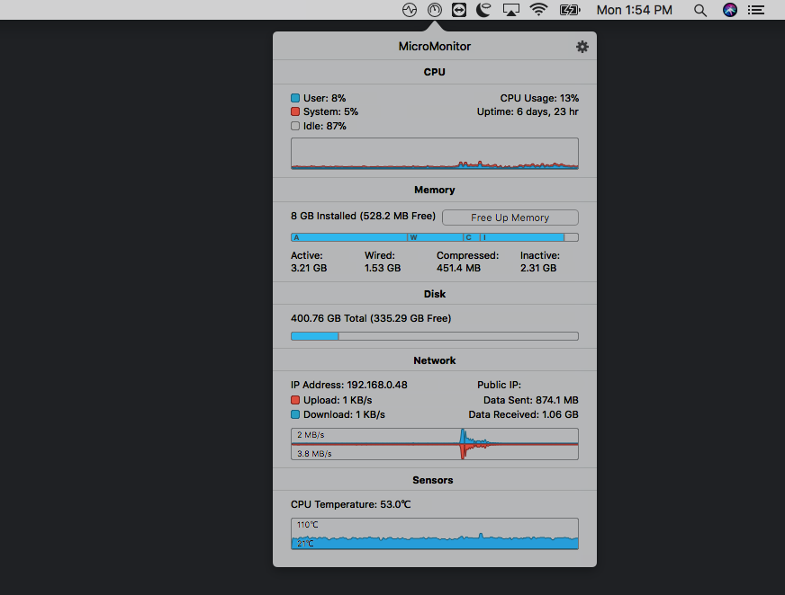
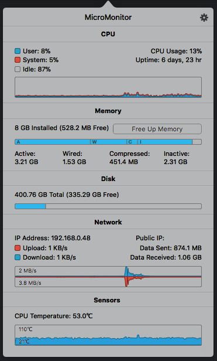
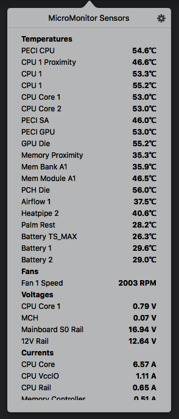

#### A full-featured open source system monitoring app for macOS.

 

  
  

  <a class="button" href="https://github.com/jackw01/MicroMonitor/releases/download/v1.0/MicroMonitor.v1.0.zip" style="margin-bottom:10px">Download</a>
  <a class="button" href="https://github.com/jackw01/MicroMonitor" style="margin-bottom:10px">View on Github</a>
  

    Version 1.0 for macOS 10.10+.
  

---

#### Features:

* CPU, memory, disk, and network usage monitoring
* Temperature, fan speed, voltage, current, and power usage monitoring
* Graphical display of the information that matters most
* Able to free up inactive memory
* Support for over 160 SMC sensors
* Lightweight app with low CPU and memory usage
* Works on every Intel Mac with macOS 10.10 or newer

Note: MicroMonitor is not under active development and is unlikely to be updated in the future.

---

  
  

MicroMonitor is open source and released under the GPL v3 license. <a href="https://github.com/jackw01/MicroMonitor">View on Github.</a>
