<a href="../assets/projects/modularmounts-stl.zip" class="button">Download STL Files (zip)</a>
<a href="../assets/projects/modularmounts-GoPro Profile.pdf" class="button">Download GoPro Profile Technical Drawing</a>

## Summary

3D printable GoPro compatible mounting accessories for cameras, phones, and more. STL files for all parts can be downloaded with the link above, and original Solidworks CAD files are included for modification. <!--The original Solidworks design files can be found in the [GrabCAD folder for this project](https://workbench.grabcad.com/workbench/projects/gcnUv4yWleEZdF-MvPbkRW6ztajOTvjOf2FrRhKy1aaAlx#/space/gcRLR5dOVLxat1oCPV2CXJvUbPfd5Zgm9qYSkP6tpdQevQ).--> All parts should be printed with 3 or more perimeters. All mounts are designed to be assembled with M5x20mm screws and M5 hex nuts.

### Tripod Screw Mount

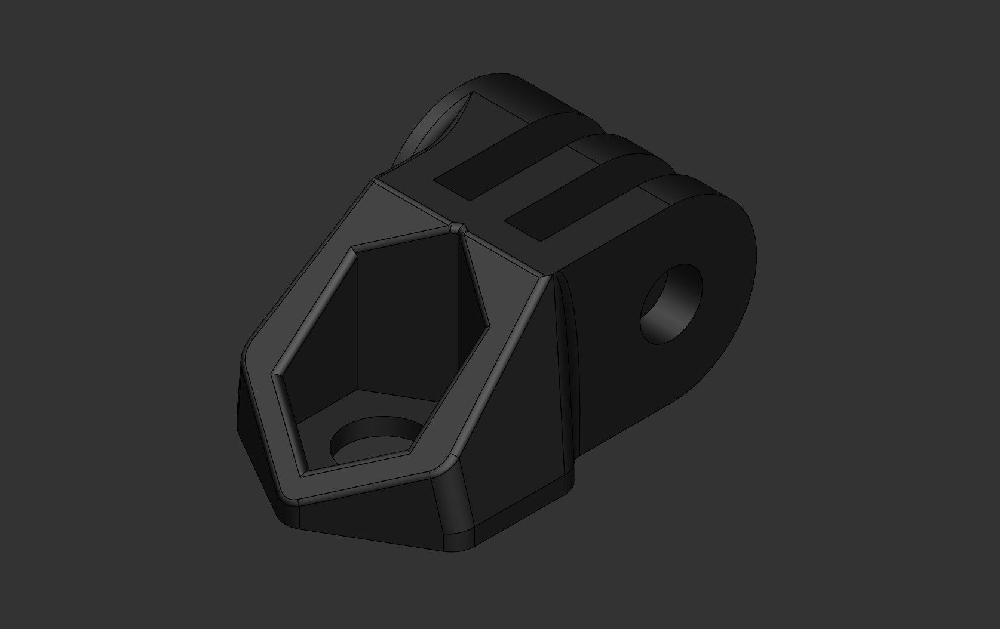

For attaching GoPro-compatible mounts to a standard 1/4-20 screw mount (requires a 1/4-20 hex nut)

### Arca-Swiss Quick Release Mount

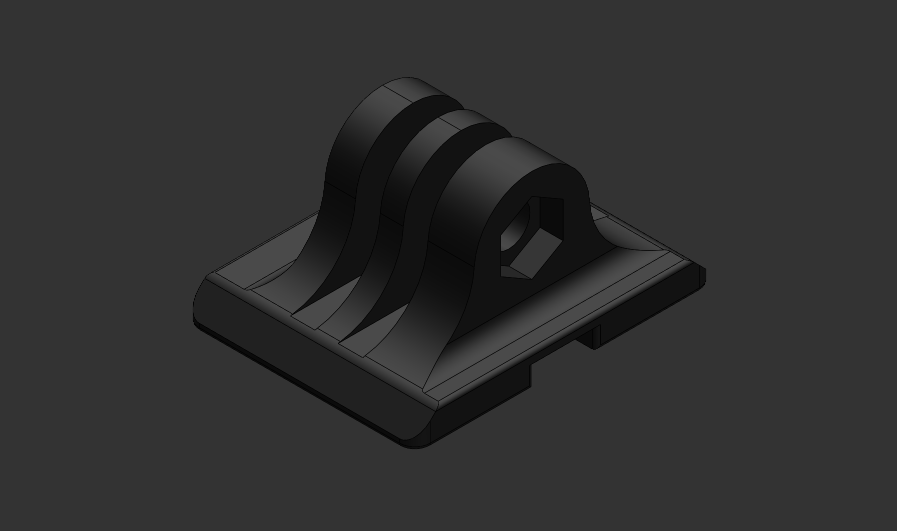

For using GoPro-compatible mounts with an Arca-Swiss style quick release tripod head

### Straight Links

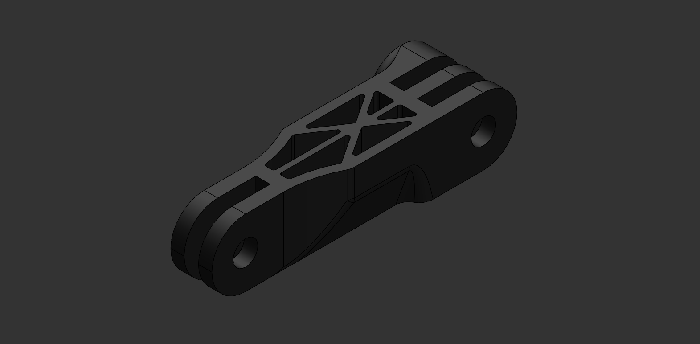

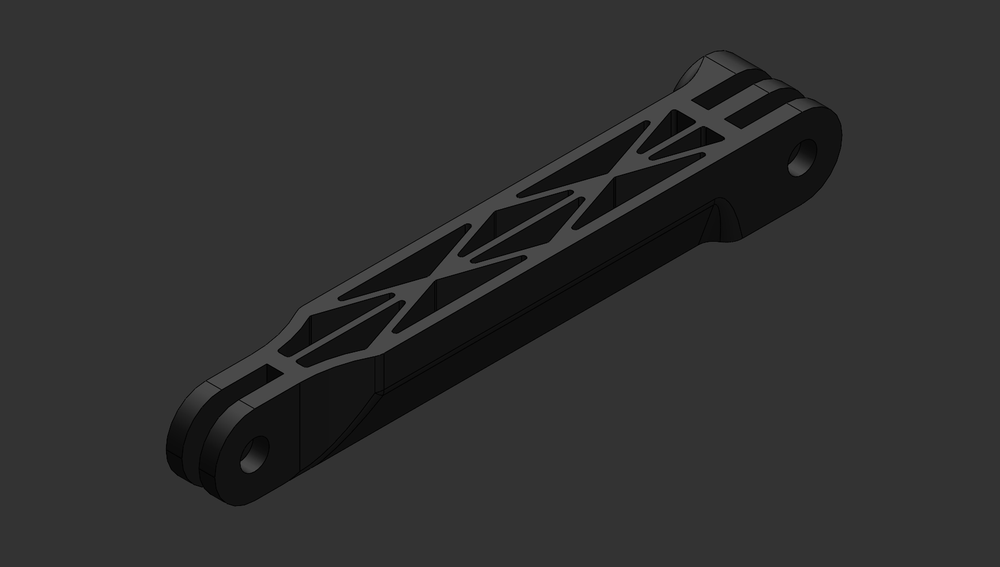

High rigidity 50mm and 100mm straight mount extensions

### Direction Changers

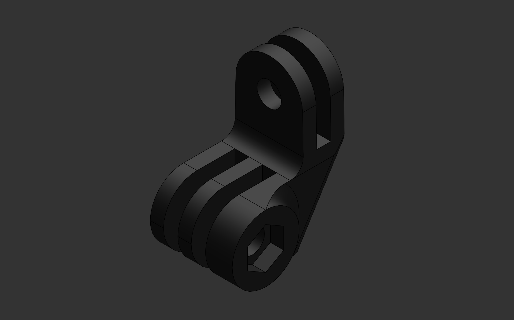

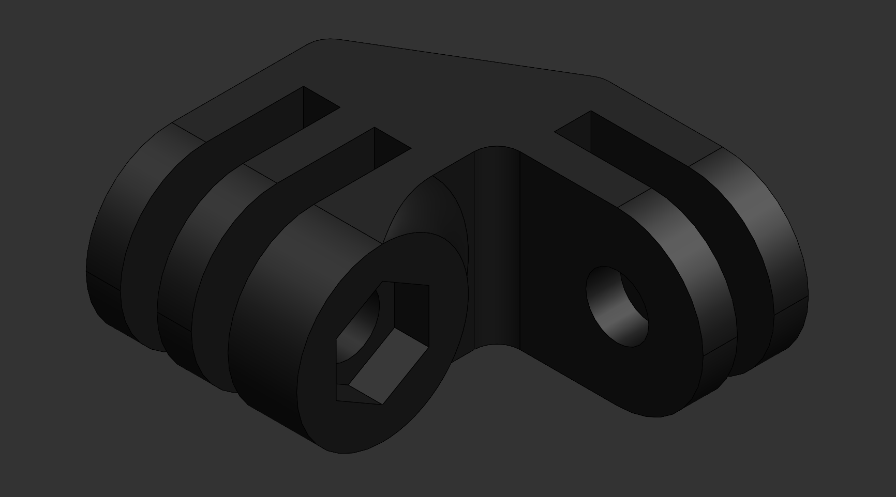

90 degree angle mount extensions

### Flat Mounts

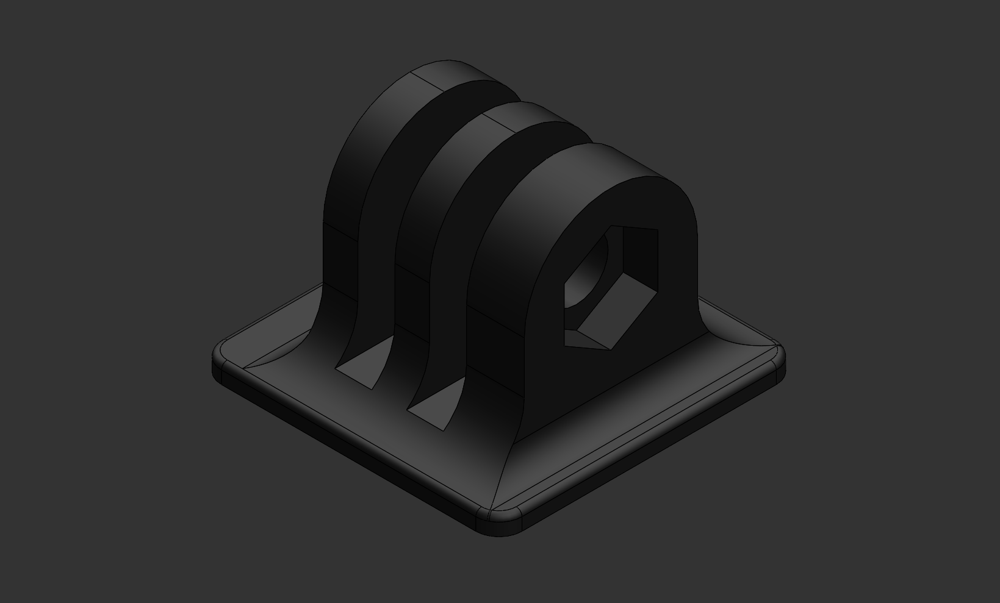

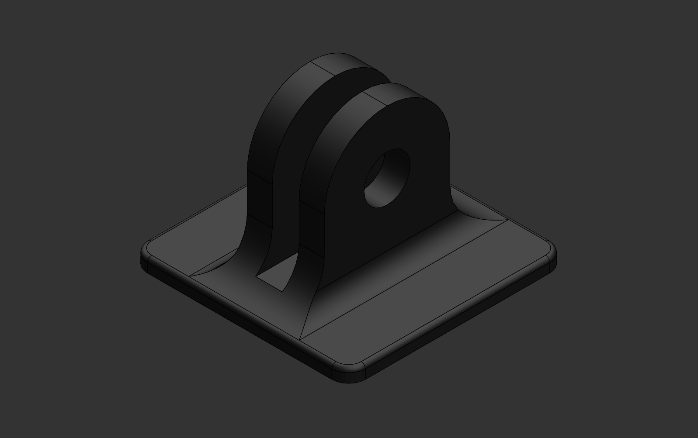

For use with VHB tape and other adhesives (1 square inch mounting area)

### Camera Side Screw Mount

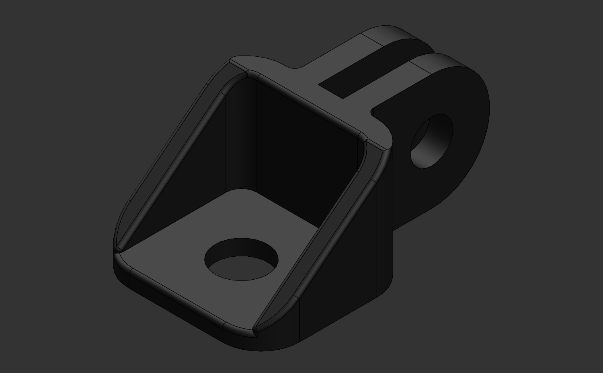

For attaching a device with a 1/4-20 threaded hole to GoPro-compatible mounts (requires a 1/4-20 camera screw with a maximum head diameter of 16mm)

### Ziptie Mount

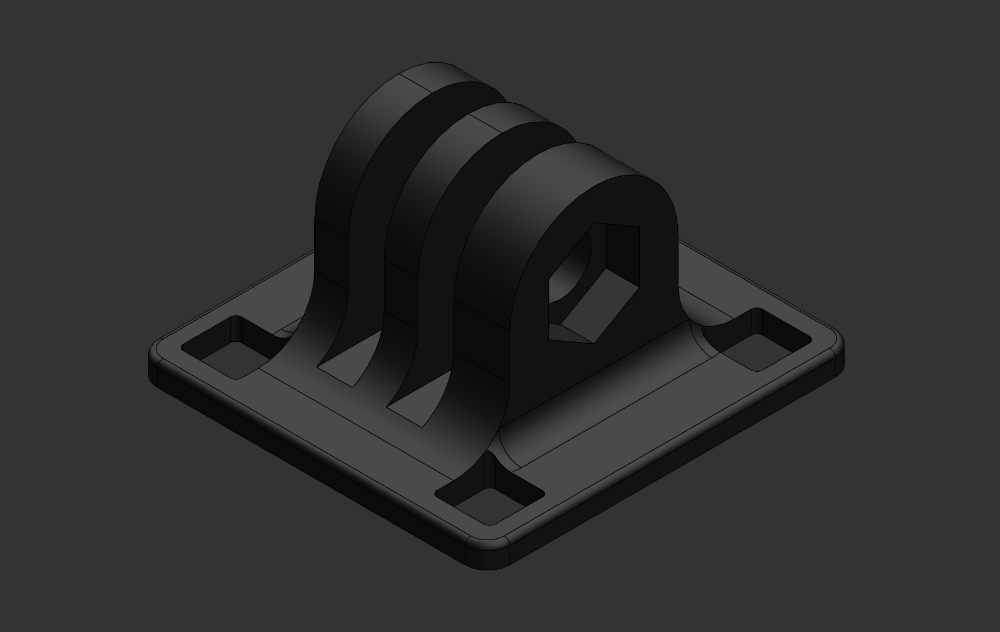

For attaching GoPro compatible mounts to a pole- or rod-shaped object with zipties up to 5mm wide

## Extras

### Phone Mount

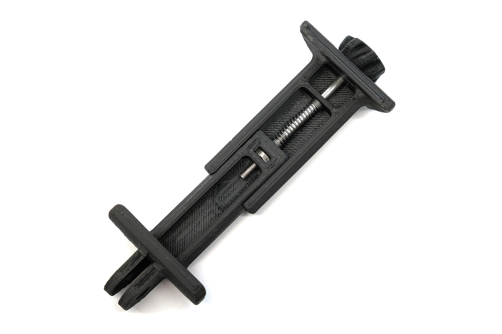

See [here](phone-clamp) for design files and more info.

## License
This work is licensed under a [Creative Commons Attribution-ShareAlike 4.0 International License](http://creativecommons.org/licenses/by-sa/4.0/).

#### Disclaimer
<small>These CAD models are not affiliated with, endorsed by or in any way associated with GoPro Inc. or its products and services. GoPro, HERO, Session, Karma and their respective logos are trademarks or registered trademarks of GoPro, Inc.</small>
