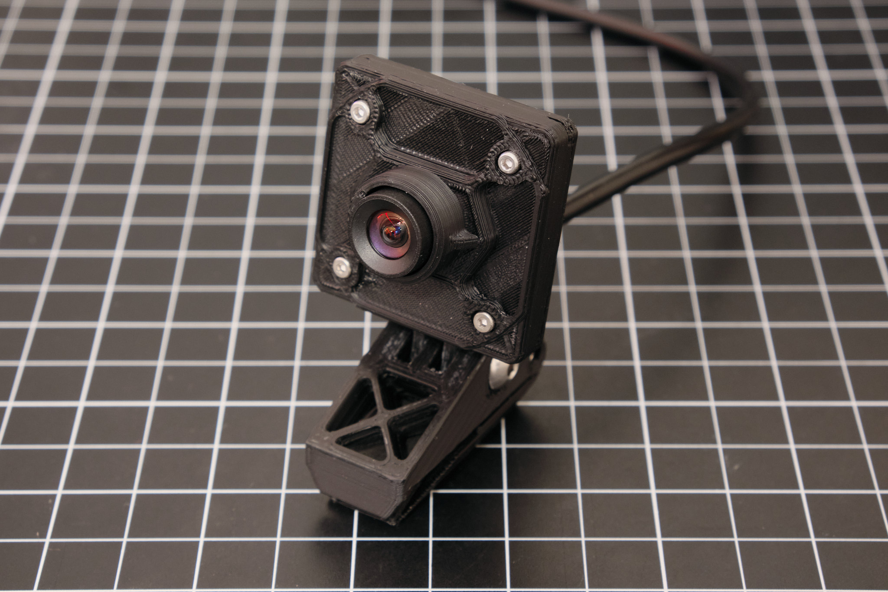
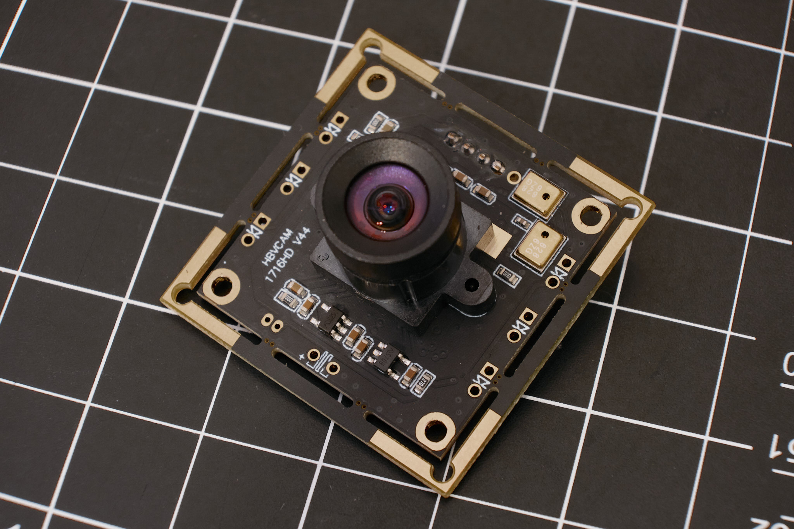
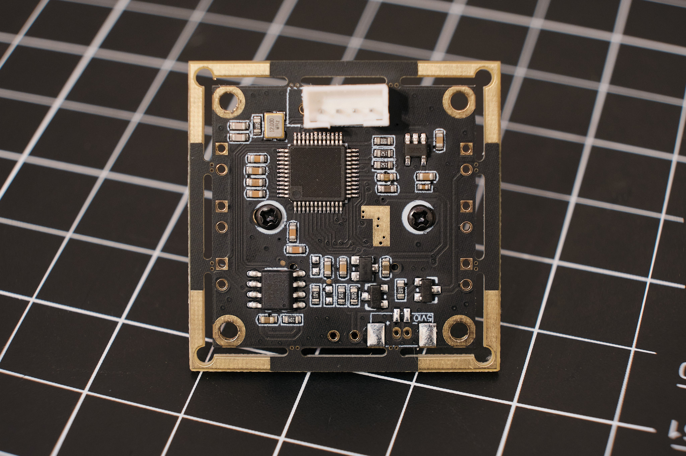
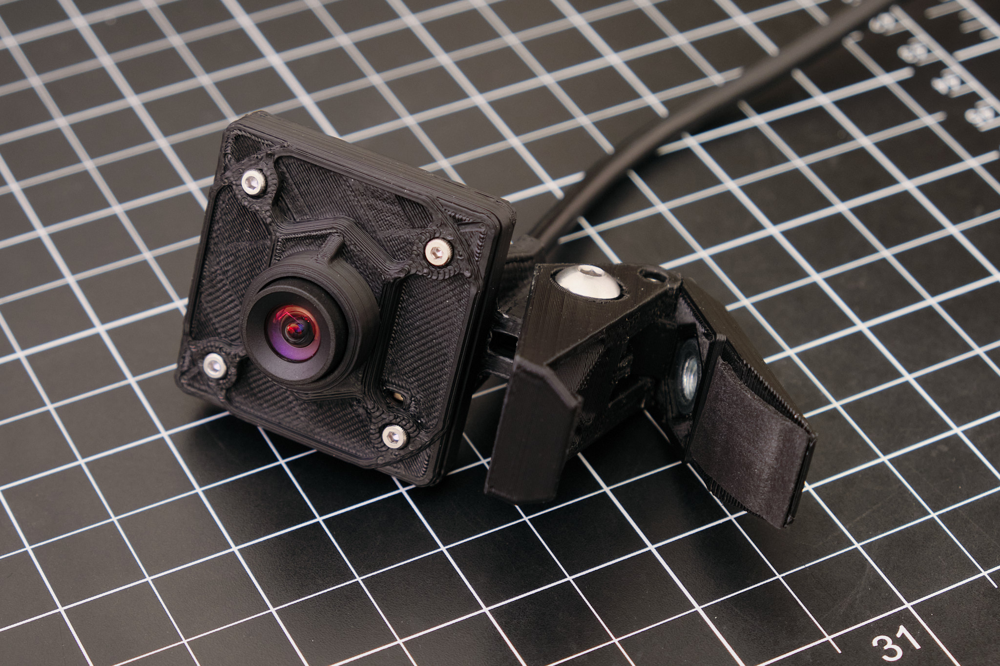
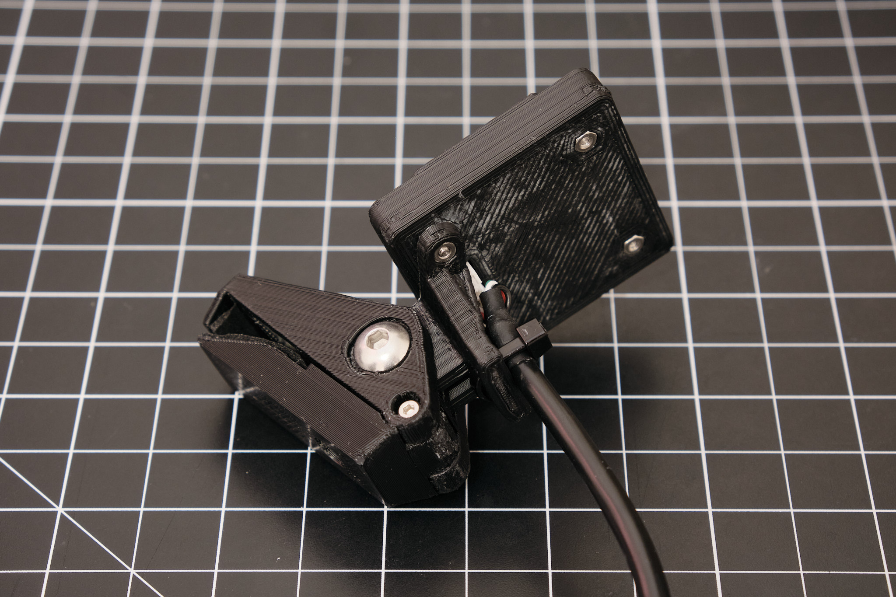

<a href="../assets/webcam/webcam STLs.zip" class="button">Download STL Files (zip)</a>

## Summary
It's 2020 and webcams are out of stock everywhere, but OV2710-based USB camera modules are readily available for just US$20-30 from eBay and AliExpress. These modules provide 1080p video at 30fps with better image quality than most cheap webcams, and have interchangeable S-mount lenses.

The module shown below is a [HBVCAM-1716](https://www.hbvcamera.com/full-hd-1080p-usb-cameras/hbvcam-1716-2710-s1.0.html) made by Huiber Vision Technology Co. Ltd.:

All of these camera modules are 38x38mm square with four 2mm diameter mounting holes in a 28mm square pattern.

Similar cameras are also available on Amazon for US$40-50, but most of these don't have microphones, the lens mount protrudes farther from the board, and the connector is positoned differently, so they may not work with this enclosure.

Required parts:
* Compatible OV2710 USB camera module
* 2x M2x8mm socket head cap screw
* 2x M3x12mm socket head cap screw
* 1x M2x16mm socket head cap screw
* 5x M2 hex nut
* 1x M5x20mm button head cap screw
* 1x M5 hex nut
* 1x 1/4-20 hex nut (optional)

## Printing
Print in any material at 20% infill with 3 or more perimeters. Supports are required for 20c-p0211 camera enclosure front.stl only. Apply thin neoprene foam tape to 20c-p0214 camera enclosure webcam stand 2.stl as shown below to improve friction, if necessary. Insert a 1/4-20 hex nut into the nut pocket on the mount to attach the camera to a tripod.

### License
This work is licensed under a [Creative Commons Attribution-ShareAlike 4.0 International License](http://creativecommons.org/licenses/by-sa/4.0/).
