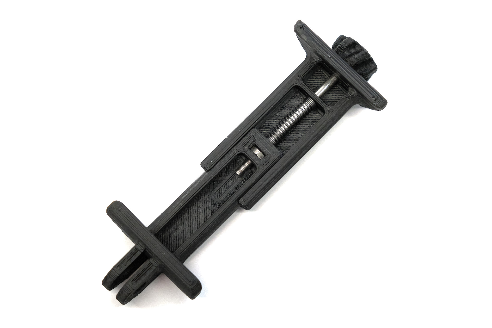

<a href="../assets/projects/phoneclamp-stl.zip" class="button">Download STL Files (zip)</a>
<a href="https://www.printables.com/model/145012-phone-clamp-tripod-mount-gopro-compatible" class="button">View on Printables</a>

## Summary

3D printable phone clamp with GoPro-compatible mount, designed for attaching a phone to a tripod or other mounting hardware. Fits phones from 69.5mm to 86mm wide (almost all recent smartphones, except the iPhone 12 Mini).

The mount has a standard GoPro-compatible adjustable angle mounting point for use with any other mounts designed for use with GoPro cameras. STL files for a 3D printable GoPro-compatible tripod mount and a 3D printable GoPro-to-Arca Swiss quick release plate adapter are included.

Parts required:
* M3x50mm socket head cap screw
* M3 hex nut
* Compression spring (~30mm long, ~10mm fully compressed)
* M5x20mm screw for GoPro mount
* M5 hex nut for GoPro mount

More GoPro mount-compatible designs are available [here](https://jackw01.github.io/pages/modular-mounts).

## Printing
Print in any material without supports. I printed the phone clamp in the photo in eSUN ABS+.

## Assembly
Press the M3 screw into the knob so that the crush ribs inside the knob deform and grip the screw head. This can be done by inserting the screw through the knob, threading a nut on the other end, holding the nut in a vise, and tightening the screw so that the screw head is forced into the knob. Assemble as shown in the photo.

### License
This work is licensed under a [Creative Commons Attribution-ShareAlike 4.0 International License](http://creativecommons.org/licenses/by-sa/4.0/).

#### Disclaimer
<small>This design is not affiliated with, endorsed by or in any way associated with GoPro Inc. or its products and services. GoPro, HERO, Session, Karma and their respective logos are trademarks or registered trademarks of GoPro, Inc.</small>
