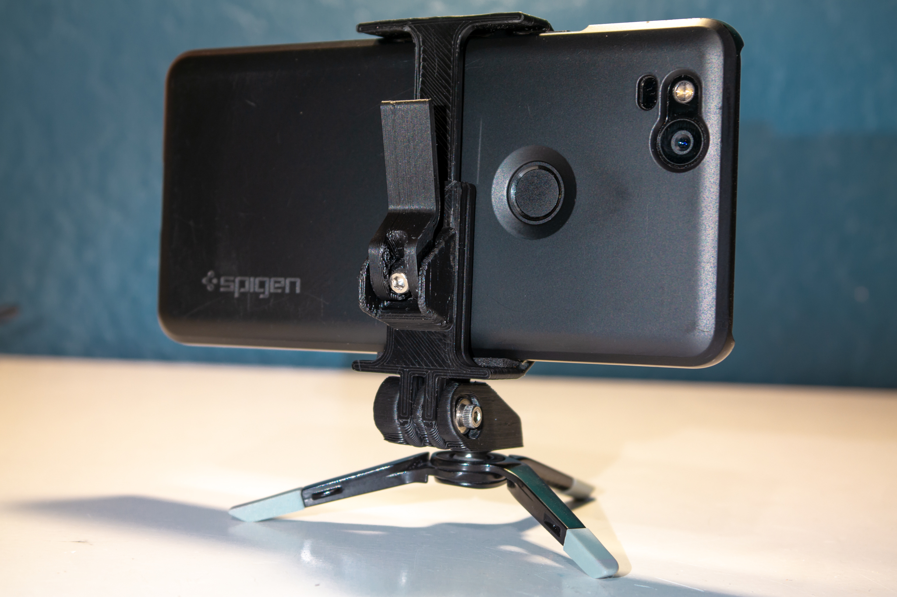
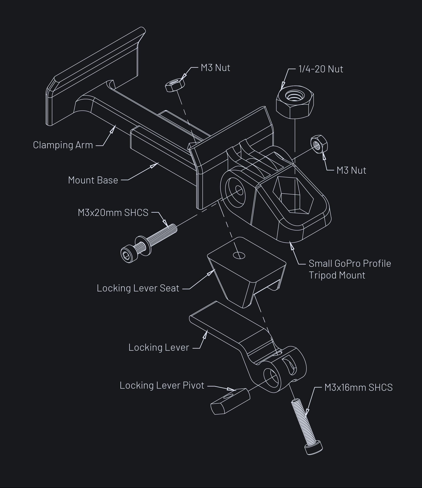
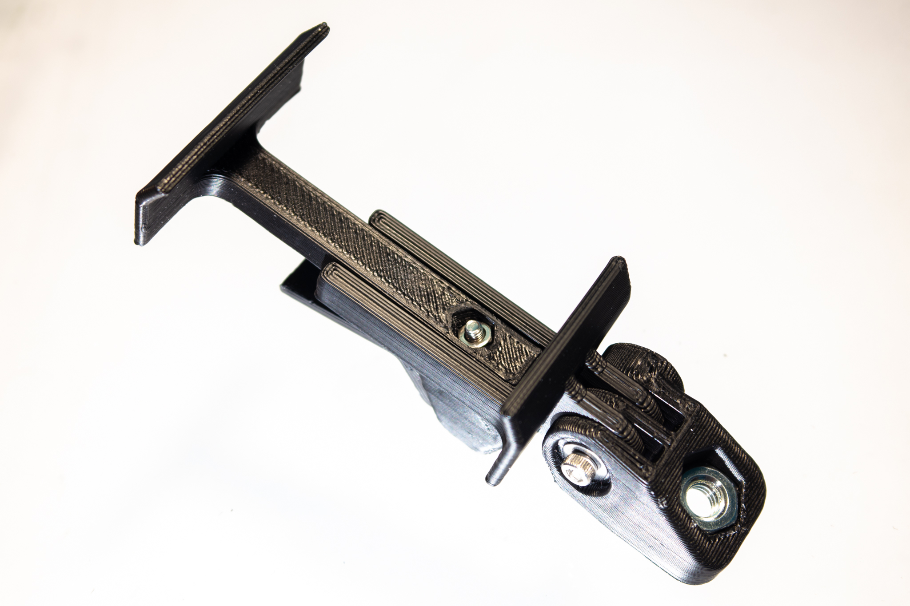
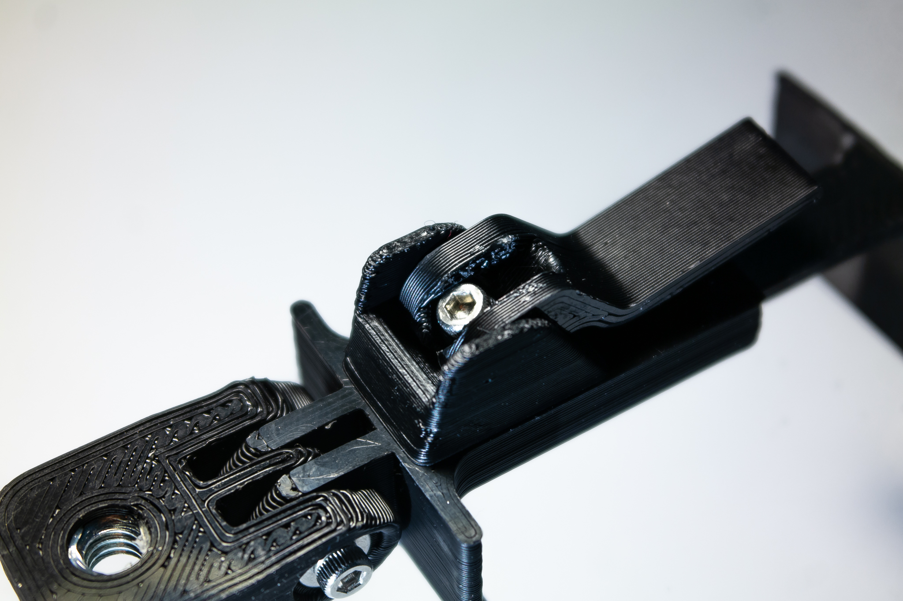
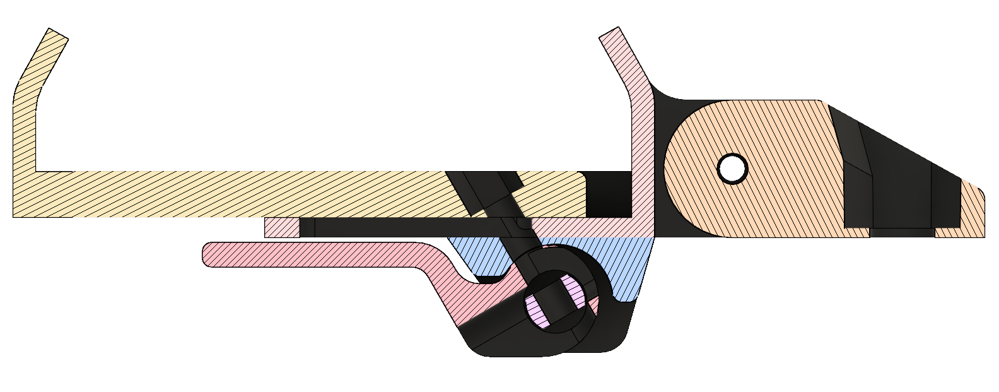

## Update
Please download the updated design [here](https://jackw01.github.io/modular-mounts/).

Informatiopn about the old design is kept below for reference:

## Summary

I designed this in an attempt to improve on existing phone tripod mount designs that use either a screw or spring tension to clamp the phone in place. This mount uses an eccentric cam lock mechanism that allows it to be quickly released and locked in place with the flip of a lever. It grips the phone more securely than a spring-loaded mount and the phone can be inserted and removed much faster than with a screw clamping mount.

## Assembly
Required parts:
* 1x M3x20mm screw
* 1x M3x16mm screw
* 2x M3 hex nut
* 1x 1/4-20 hex nut or Nylok nut

A short version of the locking lever is included, which minimizes the possibility of accidentally unlocking the mount or breaking the lever off but requires more force to operate.

**Update 2019-04-01: Added Spacer.stl with a 0.7mm thick M3 spacer. Add 1-3 of these spacers between the M3x16mm screw head and the locking lever pivot if the 16mm screw sticks too far out of the nut. This issue can occur with certain hole size compensation settings or inadequate cooling when printing the locking lever pivot.**

The mount has a standard GoPro-compatible adjustable angle mounting point for use with any other mounts designed for use with GoPro cameras. A 3d-printable GoPro-compatible tripod mount is included in this design and requires a 1/4-20 hex nut for mating with the tripod threads. The clearance hole for screwing together the GoPro mount is sized for a M3 screw, but it can be drilled out for use with larger hardware if needed.

Using some thin rubber or foam tape (neoprene tape like [this](https://www.amazon.com/Pres-P8225RL00-50XOH-Neoprene-Foam-Black/dp/B01G382DX4/) highly recommended) on the jaws will help the mount grip the phone much better.

## Printing
Print in any material at any layer height with 100% infill. Supports are required on the locking lever and GoPro mount parts. I used eSun ABS+ for the mount shown in the photos.

## Photos

### License
This work is licensed under a [Creative Commons Attribution-ShareAlike 4.0 International License](http://creativecommons.org/licenses/by-sa/4.0/).
