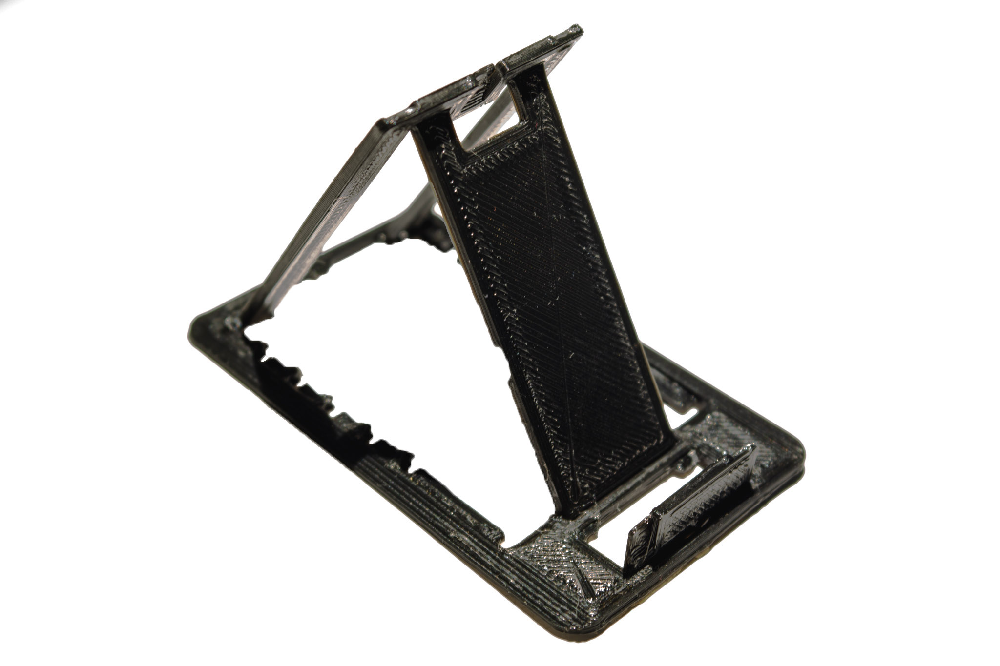
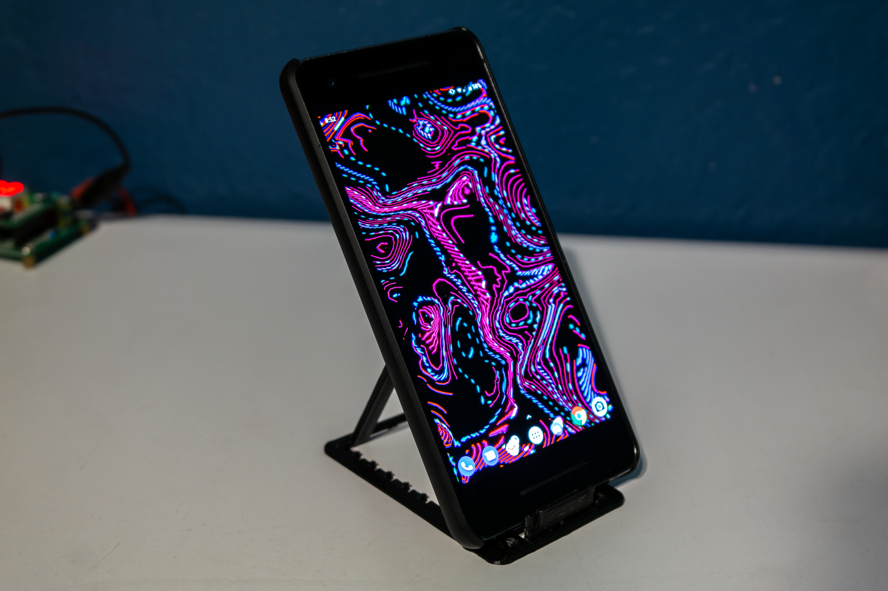

<a href="../assets/phonestand/Redesigned Thin Phone Stand v56.stl" class="button">Download STL File</a>
<a href="../assets/phonestand/Redesigned Thin Phone Stand v56.f3d" class="button">Download Fusion 360 Archive</a>

[Originally published on Thingiverse](https://www.thingiverse.com/thing:3334689)

## Summary

Credit card sized, 2mm thick print-in-place folding phone stand. Design based on [this phone stand](https://www.thingiverse.com/thing:3157890). Clearance around parts is increased to 0.4mm to make the design more forgiving and easier to print. Edges are beveled for easier insertion into thin wallets. 

## Printing
Print at 0.2mm or 0.3mm layer height. If you use X/Y size compensation, turn it off for this. I used eSUN PLA+ with maximum cooling. If the pieces fuse together at the first layer, they can easily be cut apart with a knife.

<video src="../assets/phonestand/animation.mp4" autoplay loop></video>

### License
This work is licensed under a [Creative Commons Attribution-ShareAlike 4.0 International License](http://creativecommons.org/licenses/by-sa/4.0/).
