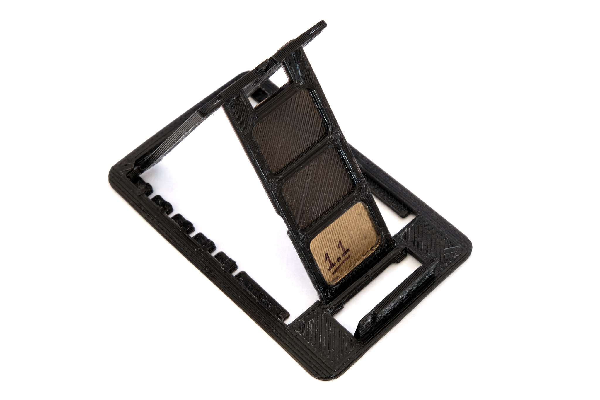
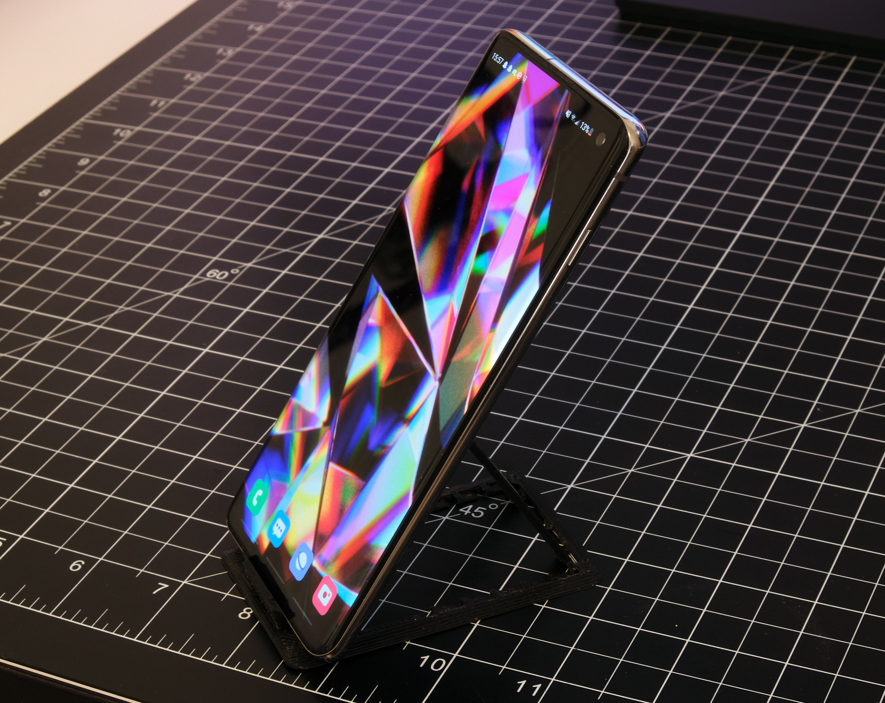

<a href="../assets/projects/phonestand-2019-10-10.stl" class="button">Download STL File</a>
<a href="../assets/projects/phonestand-2019-10-10.f3d" class="button">Download Fusion 360 Archive</a>
<a href="https://www.printables.com/model/145016-credit-card-sized-folding-phone-stand-v11" class="button">View on Printables</a>

## Summary

Credit card sized, 2mm thick print-in-place folding phone stand. Design based on [this phone stand](https://www.thingiverse.com/thing:3157890). Clearance around parts is increased to 0.4mm and pivot joints are enlarged to make the design easier to print reliably with less post-processing. Edges are beveled for easier insertion into thin wallets.

## Printing
Print in any material at up to 0.3mm layer height. Do not use X/Y size compensation. I printed the phone stand in the photos in eSUN PLA+.

### License
This work is licensed under a [Creative Commons Attribution-ShareAlike 4.0 International License](http://creativecommons.org/licenses/by-sa/4.0/).
