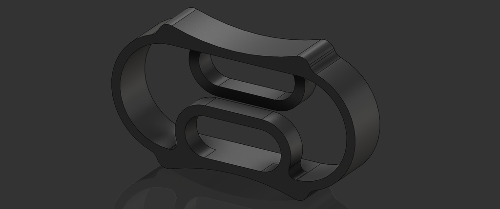
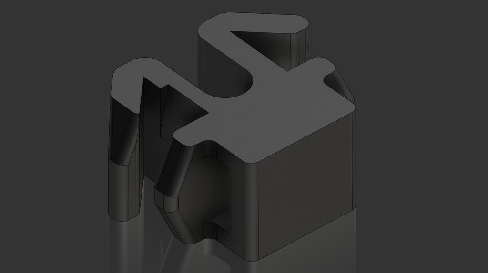
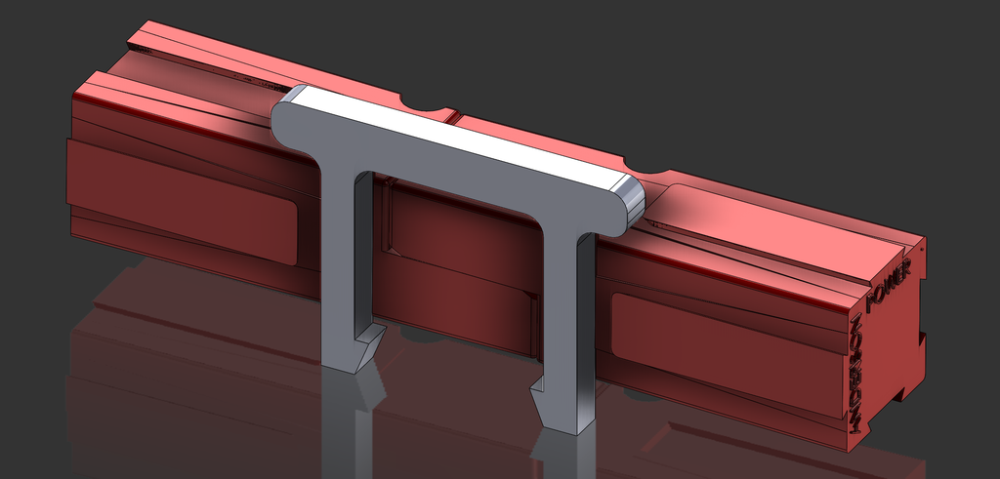

STL files for all parts as well as original Solidworks CAD files can be found in the GrabCAD folder linked below.

<a href="https://workbench.grabcad.com/workbench/projects/gcCB1yP234_nZX1W01_76lmqixo17mWjXtkitTH1PlFbeV#/space/gcpb1Bv80sNtC4WU5TikOFvemghJoOa-dDuEDdxJYnSFva/folder/10515120" class="button">View and Download on GrabCAD</a>

### Cord Stop

Single piece 3D printable cord stop, tested to work with 2mm to 4.5mm diameter nylon and polyester circular cord. The force required to release the cord is around 1-2kg depending on the materials used, similar to other mass-produced cord stops. Materials with a low flexural modulus such as PETG, PA, PC, or PP are strongly recommended; PLA, ABS, and fiber filled materials will probably not work.

### Snap-In Zip Tie Mount for 2020 Extrusion

3D printable zip tie mount that snaps into 2020 aluminum extrusion. Sized for standard small zip ties up to 3.5mm wide. Materials with a low flexural modulus such as PETG, PA, PC, or PP are strongly recommended; PLA, ABS, and fiber filled materials will probably not work.

### Anderson Powerpole Connector Retention Clip

3D printable retention clip for Anderson Powerpole 15/30/45A connectors. Print in any material.

## License
This work is licensed under a [Creative Commons Attribution-ShareAlike 4.0 International License](http://creativecommons.org/licenses/by-sa/4.0/).
